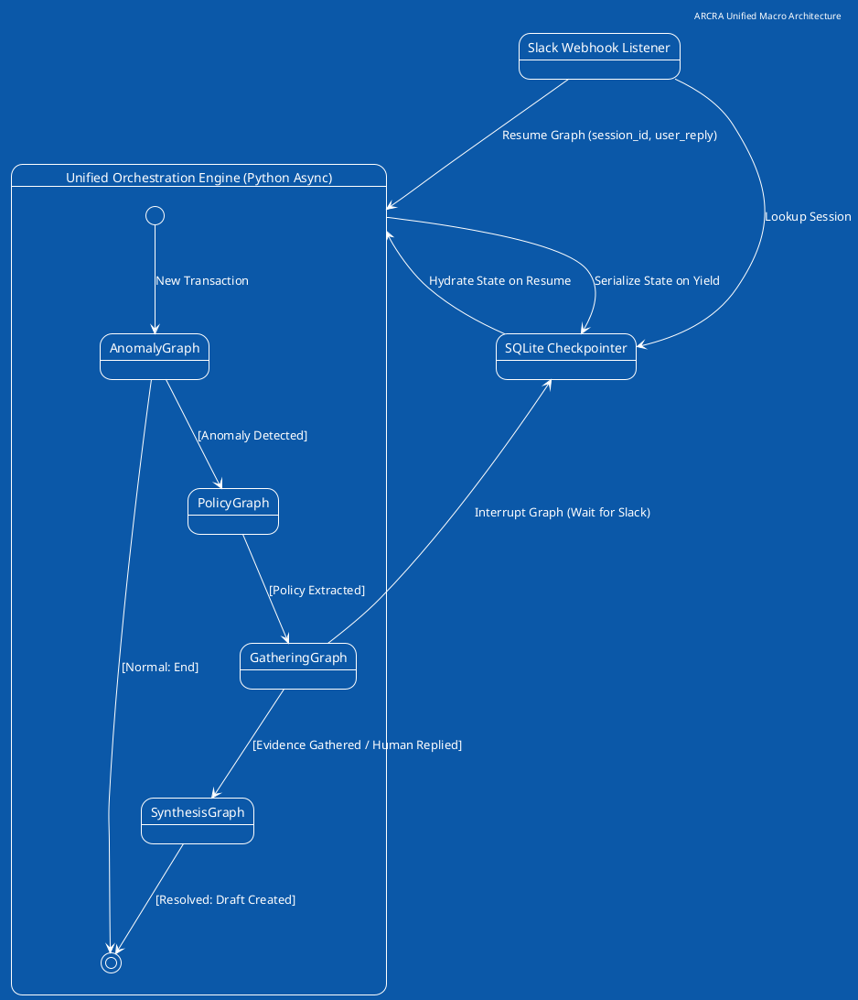

# ARCRA Architecture & Unified Execution Plan

## 1. System Topology & Unified State Strategy
The system consists of a single, unified asynchronous graph execution environment. The artificial boundary between "Fast" and "Slow" ingestion has been removed to preserve graph integrity and context continuity.

### The Unified Agentic Engine
* **Engine:** Pydantic Graph (or equivalent DAG orchestrator) with Native Checkpointing.
* **State Persistence:** SQLite operates as the explicit graph checkpointer.
* **Goal:** Execute the full lifecycle—Anomaly Detection, Policy Verification, Evidence Gathering (with native human-in-the-loop interrupts), and Synthesis.
* **Generative Engine:** Pydantic AI with the AWS Bedrock `amazon.nova-lite-v1:0` models.

## 2. Infrastructure & Data Contracts
### 2.1 Graph Checkpointing (SQLite)
The orchestrator natively serializes the graph state at every node transition.
* Table: `arcra_checkpoints`
* Primary Key: `session_id`, `thread_ts`
* The state payload contains the complete context window, tool results, and pending operations.

### 2.2 Asynchronous Intervention (The "Wait" State)
Instead of polling via Celery, the graph utilizes native `interrupt` capabilities. When querying Slack, the graph yields execution and shuts down compute. A lightweight webhook server (FastAPI) receives the Slack reply and calls `graph.resume(session_id, payload)`, continuing the mathematical flow.

## 3. AGENT IMPLEMENTATION ROUTING
* **For Ingestion logic:** Read `PLAN_anomaly.md`
* **For Rules Extraction:** Read `PLAN_policy.md`
* **For Drive/Slack traversal & Suspensions:** Read `PLAN_gathering.md`
* **For Final Evaluation:** Read `PLAN_synthesis.md`

## 4. High-Level System Orchestration (Macro HFSM)



## 5. SQLite Checkpoint Schema

```sql
-- The native checkpointing schema for the DAG orchestrator
CREATE TABLE arcra_checkpoints (
    thread_id TEXT NOT NULL,          -- Maps to the transaction session_id
    checkpoint_ns TEXT NOT NULL DEFAULT '', 
    checkpoint_id TEXT NOT NULL,      -- Unique ID for the state snapshot
    parent_checkpoint_id TEXT,        -- Allows graph rewinds/branching
    type TEXT,
    checkpoint BLOB NOT NULL,         -- Serialized Graph State (JSON)
    metadata BLOB NOT NULL,           -- Searchable metadata (status, user)
    PRIMARY KEY (thread_id, checkpoint_ns, checkpoint_id)
);

CREATE TABLE arcra_interrupts (
    thread_id TEXT PRIMARY KEY,
    status TEXT NOT NULL,             -- 'awaiting_slack', 'resumed'
    slack_message_ts TEXT,            -- To map webhook replies to the thread
    expires_at TIMESTAMP              -- For the 48-hour timeout cron
);
```