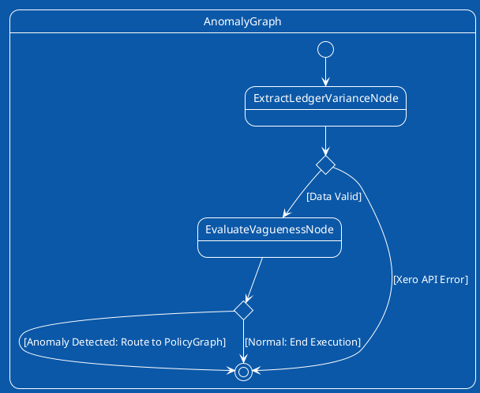

# Anomaly Detection FSM Plan

## Core Responsibility
Ingest the transaction, perform the initial variance check via AWS Bedrock, and determine if the macro graph should proceed to deeper policy verification or terminate early.

## FSM Visualization

