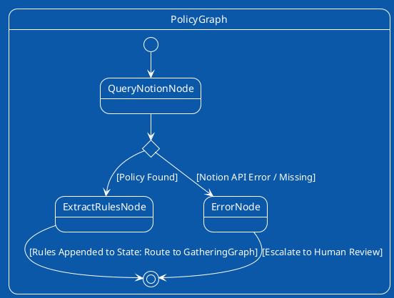

# Policy Verification FSM Plan

## Core Responsibility
Interfaces with the Notion MCP server to retrieve corporate rules and extracts semantic constraints via Pydantic AI's `BedrockModel` to inform the evidence gathering phase.

## FSM Visualization

