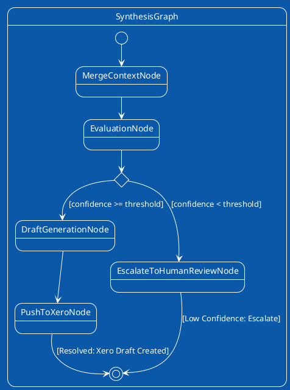

# Synthesis & Evaluation FSM Plan

## Core Responsibility
The final autonomous reasoning step. Consolidates the initial transaction, the extracted policy rules, and the gathered evidence (from Drive or Slack). Uses Pydantic AI's `BedrockModel` to calculate a confidence score and push the final draft to Xero via MCP.

## FSM Visualization

